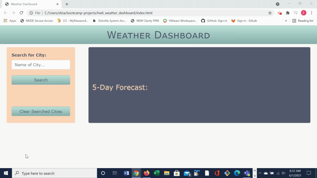

# Weather Dashboard

## Deployed Application
https://emangano2816.github.io/hw6_weather_dashboard/

## Description
Upon opening the application the user is able to search for a city.  The application will return the current and 5-day forecast for the searched city.  The current forecast displays the following elements: city name, date, an icon representation of weather conditions, the temperature, the humidity, the wind speed, and the UV index.  The UV index is color coded using the following formula:  [0,2] - green (i.e., favorable), (2,8) - orange (i.e., moderate), >= 8 - red (i.e., severe).  The 5-day forecast for the city displays: date, icon represetnation of weather conditions, the temperature, the windw spped, and the humidity.

Addtionally, the searched city is "pinned" to the application for access later on using localStorage.  The user is able to search for as many cities as desired.  Upon clicking a city that has been pinned to the page, the current and 5-day forecast will be displayed for that city.  The user also has the option to clear the searched list if it becomes unweildly. 

## Technologies Used
1. HTML
2. CSS
3. Boostrap CSS
4. Javascript
5. jQuery
6. Moment.js
7. Third-party API

## Application Functionality

## Contact Information
emangano2816@gmail.com
